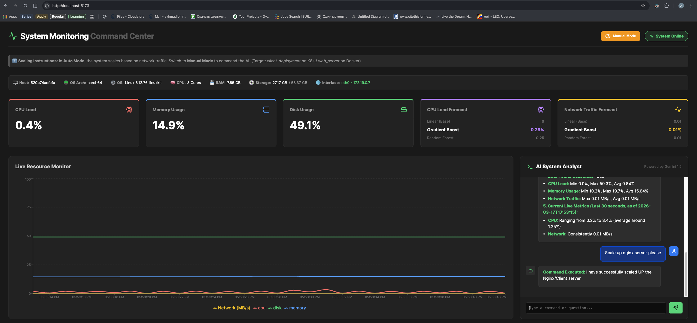

# System Monitoring App: AI-Powered DevOps Command Center


<div align="center">
  
</div>

**System Monitor** is an autonomous, self-healing Infrastructure-as-a-Service (IaaS) platform. It monitors system resources in real-time, predicts future traffic loads using Machine Learning, and autonomously scales containerized applications to meet demand. It features a built-in RAG (Retrieval-Augmented Generation) AI agent that acts as a virtual Site Reliability Engineer (SRE), capable of interpreting live metrics, reading DevOps runbooks, and executing infrastructure commands via a natural language chat interface.

## ✨ Core Features
* 📊 **Real-Time Telemetry:** Collects and visualizes CPU, Memory, Disk, and Network traffic (KB/s) with a React/Recharts dashboard.
* 🧠 **Predictive AI Scaling:** Utilizes an arena of Scikit-Learn models (Linear Regression, Random Forest, Gradient Boosting) to forecast upcoming network and compute loads.
* 🤖 **Autonomous Autoscaler:** A background daemon that dynamically scales Nginx replica clusters up/down based on live network traffic thresholds.
* 🎚️ **State Management (Auto/Manual Override):** Real-time database-backed toggle allowing operators to pause the autonomous agent and assume manual control.
* 💬 **AI SRE Chatbot (RAG):** Integrated Gemini 2.5 LLM contextually aware of the hardware host, historical 24h database summaries, and live logs. It can execute physical Docker/K8s scaling commands via chat.
* 🐳 **Hybrid Orchestration:** Fully decoupled code designed to run seamlessly on a local **Docker Compose** sandbox OR on cloud **Kubernetes (K3s)** cluster.

## 💻 Tech Stack
*   **Frontend:** React.js, Vite, Recharts, Lucide Icons, Axios, React-Markdown.
*   **Backend:** Python 3.12, FastAPI, Uvicorn, Pydantic, Psutil.
*   **Data & AI:** PostgreSQL 15, ChromaDB, Scikit-Learn, Pandas & Nummpy, Google Generative AI (Gemini 2.5 Flash).
*   **DevOps & Automation:** Docker, Docker Compose, Kubernetes (K3d/K3s), Kubectl, Kubernetes RBAC, Traefik, Ansible, GitHub Actions, GHCR (GitHub Container Registry).

## 🏗️ System Architecture & Data Flow
System Monitoring is built using a decoupled, microservices architecture designed to run on both single-node Docker environments and multi-node Kubernetes clusters.

### 1. The Telemetry Pipeline (Observability)
A background Python daemon (`monitor.py`) continuously polls the host system and container network interfaces using `psutil`. This raw telemetry (CPU, RAM, Disk, Network KB/s) is ingested into a **PostgreSQL** database every second, creating a robust time-series dataset.

### 2. The AI & Knowledge Base (RAG via ChromaDB)
The "Brain" of the system relies on **Google's Gemini 2.5 Flash** LLM. To prevent hallucinations and provide accurate technical support, the system uses a **ChromaDB Vector Database**.
- **Ingestion:** On startup, technical DevOps runbooks and cluster rules are vectorized and stored in ChromaDB.
- **Retrieval:** When a user asks a question, the backend queries ChromaDB for relevant documentation and injects it into the LLM's prompt alongside the last 24 hours of PostgreSQL metrics.

### 3. The Control Loop (Autoscaler & Actuator)
An autonomous Python agent (`autoscaler.py`) evaluates the PostgreSQL metrics every 5 seconds.
- If network traffic exceeds **2 MB/s**, it triggers a `Scale Up` event. 
- If traffic drops below **50 KB/s**, it triggers a `Scale Down` event. 
- The **Actuator** class dynamically detects its environment. If running locally, it mounts `/var/run/docker.sock` to control Docker Compose. If running in K8s, it uses a dedicated `ServiceAccount` with RBAC permissions to patch Deployments via the Kubernetes API.

### 4. CI/CD Pipeline (GitHub Actions)
Upon pushing code to the `main` branch, **GitHub Actions** provisions a runner, builds the FastAPI Backend and React Frontend Docker images, and publishes them securely to the **GitHub Container Registry (GHCR)**.

## 🚀 Getting Started
### Prerequisites
*   [Docker Desktop](https://www.docker.com/products/docker-desktop/) installed and running.
*   A [Google Gemini API Key](https://aistudio.google.com/app/apikey).

### 1. Configuration
Clone the repository and set up your environment variables:
```bash
git clone https://github.com/YOUR_USERNAME/system_monitoring_app.git
cd system_monitoring_app
```

#### Copy the example env file and insert your API Key
```bash
cp .env.example .env
```

### 2. Deployment (Choose Your Orchestrator)
**Option A: One-Click Ansible Provisioning (Recommended).** Use the included Ansible playbook to automatically install dependencies, configure your machine, and launch the *Docker sandbox*.
```bash
ansible-playbook ansible/setup.yml
```

**Option B: Manual Docker Sandbox.** Runs the entire stack, including the background agents, in pure Docker Compose. Ensure `ORCHESTRATOR=docker` is set in your `.env`.
```bash
docker compose up -d --build
```

**Option C: Kubernetes Cluster (K3d).** Simulate a highly available cloud environment using the provided K8s manifests.
```bash
# Create the virtual cluster with a load balancer on port 8081
k3d cluster create system-monitor-cluster --api-port 6550 -p "8081:80@loadbalancer" --agents 2

# Build the images
docker build -t system-monitor-backend:v1 -f Dockerfile.backend .
docker build -t system-monitor-frontend:v1 -f Dockerfile.frontend .

# Import images into the cluster
k3d image import system-monitor-backend:v1 system-monitor-frontend:v1 -c system-monitor-cluster

# Apply manifests (Secrets, PVCs, Deployments, Services, Ingress, RBAC)
kubectl apply -f k8s/
```

## 🎮 How to Use the Command Center
1. **Access the Dashboard:**
    - If using Docker: http://localhost:5173
    - If using Kubernetes: http://localhost:8081
2. **Monitor Traffic:** Watch the Network graph. The Autoscaler will automatically add Nginx replicas if traffic exceeds 2 MB/s and remove them when idle.
3. **Command the AI:**
    - Toggle the switch at the top right to **Manual Mode**.
    - Open the Chat Widget.
    - Type: *"Scale up the web server please."*
    - The AI will process the intent and execute a physical scaling command against the Docker Socket / K8s API.

## 🧪 Simulating Network Load
To trigger an automatic scale-up event, generate dummy network traffic inside the monitor container:

**Docker Mode:**
```bash
docker exec -it system-monitor-agent /bin/sh -c "while true; do curl -o /dev/null -s http://speedtest.tele2.net/100MB.zip; sleep 1; done"
```

**Kubernetes Mode:**
```bash
kubectl exec -it deploy/monitor-deployment -- /bin/sh -c "while true; do curl -o /dev/null -s http://speedtest.tele2.net/100MB.zip; sleep 1; done"
```
*Press Ctrl+C to stop the traffic and watch the system automatically scale back down.*